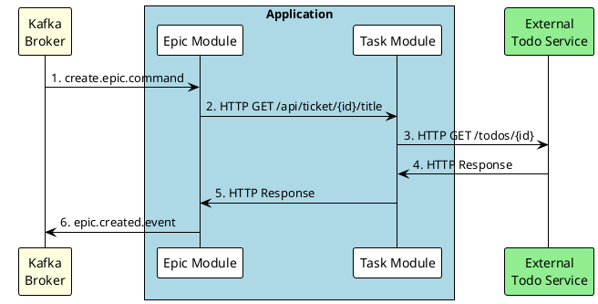

# Utilitest

Utilitest is a collection of test-specific utilities for working with
popular testing libraries, such as AssertJ, Mockito, and Awaitility.

The tracing module offers support for injecting traceIDs into tests, 
for correlating the test logs or verifying the correct trace propagation.


## Distributed Tracing Module

The tracing module allows us to test the correct trace propagation for SpringBoot applications.

Here's a typical flow of a request through multiple services with automatic trace propagation:



We can test the trace propagation for Kafka and HTTP requests, 
using the [TracingKafkaExtension](./tracing/kafka/src/main/java/io/github/etr/tracting/kafka/KafkaTracingExtension.java) 
and [TracingHttpExtension](./tracing/http/src/main/java/io/github/etr/tracting/http/TracingHttpExtension.java) JUnit extensions.

Here is an example of a test that uses the _TracingKafkaExtension_, 
which will inject a _KafkaTemplate_ object into the test.
As a result, a _traceparent_ header will be automatically 
injected into all messages sent using this _kafkaTemplate_ instance:

```java
@ExtendWith(KafkaTracingExtension.class)
class TracingKafkaTest extends IntegrationTest {

    @Test
    void integrationTest(
        @Traceable Traceparent traceparent,
        @Traceable KafkaTemplate<Object, Object> kafkaTemplate
    ) throws Exception {

        // given
        kafkaTemplate.send("create.epic.command",
            new CreateEpicCommand("Migrate to JUnit5", List.of(1L, 2L))).get();

        // when
        var messageOut = consumeOneMessage("epic.created.event", ofSeconds(10));

        // then
        var headerOut = messageOut.headers()
            .headers("traceparent")
            .iterator().next();
        assertThat(headerOut)
            .extracting(it -> new String(it.value())).asString()
            .contains(traceparent.traceId())
            .doesNotContain(traceparent.spanId());
    }
}
```

As we can see, we can use the injected _Traceparent_ instance 
to inspect the _traceId_ and _spanId_ of the current test trace.

In our test, we treat the application like a black box, 
only decorating the input message with a traceparent header
and verifying the outgoing messages to see if the _traceId_ is propagated.

## JUnit Lambdas

Utilitest provides a JUnit extension that enables us to use lambda expressions 
instead of the commonly used Before/After Each/All block methods.

This library provides annotations to simplify test lifecycle management in JUnit 
by allowing you to define setup and cleanup logic directly on fields. 
The annotations [@DoBeforeAll](junit-lambdas/src/main/java/io/github/etr/junit/lambdas/DoBeforeAll.java),
[@DoBeforeEach](junit-lambdas/src/main/java/io/github/etr/junit/lambdas/DoBeforeEach.java),
[@DoAfterAll](junit-lambdas/src/main/java/io/github/etr/junit/lambdas/DoAfterAll.java),
and [@DoAfterEach](junit-lambdas/src/main/java/io/github/etr/junit/lambdas/DoAfterEach.java),
enable concise and readable test code by invoking specified methods 
or functional interfaces before/after tests.

We can use these annotations at a field level in two ways:
1. **We can annotate fields that are functional interfaces**: 
```java
static File resource;

@DoBeforeAll
static ThrowingRunnable setUp = () -> 
    resource = Files.createTempFile("test", ".tmp").toFile();

@DoAfterAll
static ThrowingRunnable tearDown = () -> 
    resource.delete();
```
1. **We can annotate other fields and define the method to invoke**: 
```java
@DoBeforeEach(invoke = "init")
@DoAfterEach(invoke = "reset")
static Resource resource = ...;
```
### Example

Here is a simple test which doesn't use any of the annotations:

```java
import java.io.IOException;

class JunitLambdasReadmeTests {

    static File resource = null;

    @BeforeAll
    static void setUp() throws IOException {
        resource = Files.createTempFile("test", ".txt").toFile();
    }

    @BeforeEach
    void clean() throws IOException {
        Files.writeString(resource.toPath(), "", TRUNCATE_EXISTING, WRITE);
    }

    @AfterAll
    static void tearDown() throws IOException {
        Files.delete(resource.toPath());
    }

    // some tests...
}
```

With Junit-lambdas, we can simplify the code to:

```java 
@ExtendWith(JunitLambdasExtension.class)
class JunitLambdasReadmeTests {

    @DoAfterAll(invoke = "delete")
    static File resource = null;

    @DoBeforeAll
    static ThrowingRunnable setUp = () -> 
        resource = Files.createTempFile("test", ".txt").toFile();

    @DoBeforeEach
    ThrowingRunnable clean = () -> 
        Files.writeString(resource.toPath(), "", TRUNCATE_EXISTING, WRITE);

    // some tests...
}
```    

## AssertJ + Awaitility

This module offers a simple way to combine AssertJ assertions with Awaitility.

We'll take advantage of the _Condition<>_ class, one of AssertJ's extension points.
We can use `eventually().goingTo(...)` to create an eventual condition:

```java
assertThat(legolas)
    .is(
      eventually()
        .goingTo(
          it -> it.hasFieldOrPropertyWithValue("age", 100)));
```

Or we can use a more concise syntax:

```java
assertThat(legolas)
    .is(
      eventually(
          it -> it.hasFieldOrPropertyWithValue("age", 100));
```

For the polling interval and timeout, we'll rely on Awaitility's default settings. 
They can be set via the following config:
```java
assertThat(legoals)
    .is(
        eventually()
            .within(5, SECONDS)
            .checkingEvery(1, MILLISECONDS)
            .goingTo(
                it -> it.hasFieldOrPropertyWithValue("age", 555)));
```

## AssertJ + Mockito's _AssertMatcher_ 

To use _verify()_ mocks, we generally have two options. We can either capture the arguments 
using a _Captor_, which adds some boilerplate code and overhead, 
or we can use Mockito's _ArgumentMatchers_ to verify the arguments directly with a lambda:

```java
@Test
void customAssertMatcher() {
  FooService mock = Mockito.mock();
  mock.process(new Account(1L, "John Doe", "johnDoe@gmail.com"));

  Mockito.verify(mock).process(
    Mockito.argThat(
      it -> it.getAccountId().equals(1L)
        && it.getName().equals("John Doe")
        && it.getEmail().equals("johndoe@gmail.com")));
}
```

However, the failure messages from these custom argument matchers are often cryptic, 
making it difficult to pinpoint the cause of the test failure.

As a workaround, we can use a fluent AssertJ assertion within the custom _ArgumentMatcher_ 
and always return true. 

While this solution provides much clearer error messages, it comes with 
the downside of adding a lot of boilerplate code. If the code is repetitive, 
it can make the tests harder to read and maintain.

So, let's remove all this ceremony and use utilitest's `MockitoAndAssertJ::argHaving` instead:

```java
Mockito.verify(mock).process(
  argHaving(it -> it
    .hasFieldOrPropertyWithValue("accountId", 1L)
    .hasFieldOrPropertyWithValue("name", "John Doe")
    .hasFieldOrPropertyWithValue("email", "johndoe@gmail.com")));
```
This approach brings together the best of both worlds: the convenience of verifying 
the argument using a lambda expression and the fluent API of AssertJ, 
providing clear and descriptive error messages:

```plaintext
java.lang.AssertionError: 
Expecting
  io.github.etr.utilitest.mockito.ReadmeExampelsTest$Account@f5c79a6
to have a property or a field named "email" with value
  "johndoe@gmail.com"
but value was:
  "johnDoe@gmail.com"
```

### Other Assertions

The `MockitoAndAssertJ::argHaving` from the previous example enables us 
to consume an ObjectAssert from AsserJ, that provides some basic assertions. 
The assertJ API allows us to change this type to a more specialized instance of assertion, 
to verify specific properties. For example, we can change the assertion type to a MapAssert 
to be able to check specific key-value entries:

```java
@Test
void asInstanceOf() {
  Map<Long, String> data = Map.of(
    1L, "John",
    2L, "Bobby"
  );

  FooService mock = Mockito.mock();
  mock.processMap(data);

  verify(mock).processMap(
    argHaving(it -> it
      .asInstanceOf(InstanceOfAssertFactories.MAP)
      .containsEntry(1L, "John")
      .containsEntry(2L, "Bobby")));
}
```
With MockitoAndAssertJ, we can also specify InstanceOfAssertFactories upfront. 
To achieve this, we split the argThat into two separate methods: 
`MockitoAndAssertJ.arg(InstanceOfAssertFactories.MAP).that(it -> ...)`. 

Let's use this API to verify a method that accepts a _LocalDateTime_ and a _List_ of Strings:

```java
@Test
void arg_that() {
  FooService mock = Mockito.mock();
  mock.processDateAndList(now(), List.of("A", "B", "C"));

  verify(mock).processDateAndList(
     arg(TEMPORAL).that(time -> time.isCloseTo(now(), within(500, MILLIS))),
     arg(LIST).that(list -> list.containsExactly("A", "B", "C"))
  );
}
```